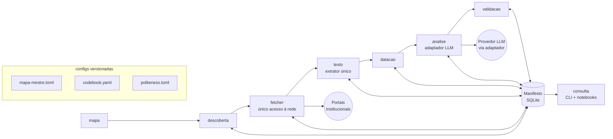
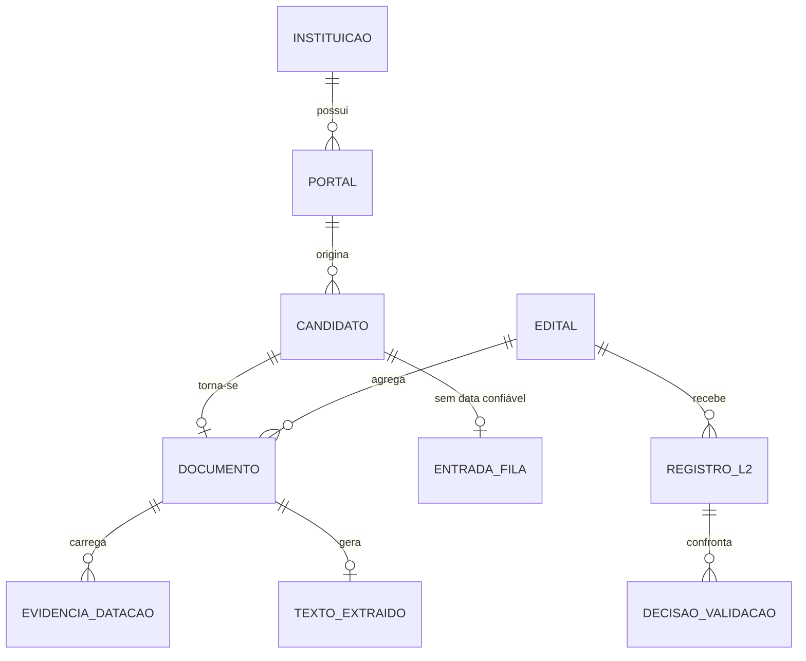

# Architecture Spine — Agente de Editais de Inovação da Rede Federal EPCT

## Design Paradigm

**Pipeline em lotes orientado a catálogo** — pipes-and-filters onde cada filtro é um comando CLI idempotente e o "tubo" entre filtros é o **Manifesto SQLite** mais convenções de filesystem. Nenhum serviço residente, nenhum scheduler: uma execução é `uv run` encadeando comandos, retomável a qualquer momento porque todo estado vive no catálogo transacional. O modelo carrega de graça: retomabilidade (estado é dado, não memória de processo), custódia (toda mutação é linha registrável), e simplicidade operacional (máquina local, backup = copiar pasta).

Mapa paradigma → pacotes: `mapa` → `descoberta` → `fetcher` (rede única) → `texto` → `datacao` (consome o texto extraído — um só extrator no sistema) → `analise` (adaptador LLM) → `validacao` → `consulta`, todos mediados por `manifest` (única escrita SQLite).

## Invariants & Rules

### AD-1 — Paradigma: lotes idempotentes orientados ao Manifesto `[ADOPTED]`

- **Binds:** all (FR-1..FR-21)
- **Prevents:** serviços residentes/schedulers; estado vivo em processo; módulos com stores próprios (JSON sidecars, CSVs paralelos)
- **Rule:** cada estágio expõe-se como comando CLI idempotente; toda mutação de estado passa pelo Manifesto via `manifest.py`; interromper e relançar qualquer comando produz o mesmo estado que executá-lo sem interrupção

### AD-2 — Corpus bruto imutável `[ADOPTED]`

- **Binds:** coleta (FR-9..11), texto (FR-15..16)
- **Prevents:** edição silenciosa de PDF/txt pós-captura; correção "no lugar" que quebra a cadeia de custódia
- **Rule:** PDFs e textos extraídos são write-once; hash SHA-256 calculado e verificado na gravação; qualquer correção cria nova versão registrada no Manifesto, nunca sobrescreve bytes

### AD-3 — Manifesto SQLite é o único estado compartilhado

- **Binds:** all
- **Prevents:** fontes paralelas de verdade; módulos que se conversam diretamente por arquivos privados; divergência entre contagens de estágios diferentes
- **Rule:** schema único versionado (`manifest.py` é o único escritor); modo WAL; **exclusividade imposta**: `manifest.py` adquire lock exclusivo no startup de cada comando — segundo processo falha rápido com erro claro (leitores concorrentes usam snapshot WAL); toda unidade de trabalho em transação; tabela `eventos` append-only registra ações relevantes para custódia

### AD-4 — Direção estrita de dependências

- **Binds:** organização de pacotes
- **Prevents:** ciclo entre estágios; consulta lendo PDFs ad-hoc (FR-21); análise dependendo do fetcher
- **Rule:** dependências fluem apenas na ordem do pipeline; interesseiro comunica-se exclusivamente via Manifesto/esquemas compartilhados; exceção única e explícita: a verificação pré-voo (FR-2) é um subcomando do estágio de coleta executado VIA fetcher — `mapa.py` nunca faz I/O de rede



### AD-5 — Polidez concentrada no fetcher

- **Binds:** coleta, resgate wayback futuro (FR-14)
- **Prevents:** drift de cortesia — novo módulo que abre conexão própria ignora robots.txt/delays/off-peak
- **Rule:** `fetcher.py` é o único pacote que faz I/O de rede; requests+BS4 e Playwright vivem ATRÁS dele. **Gatilho Playwright (FR-4, decisão assumida aqui):** usa Playwright quando (a) o portal estiver marcado `dinamico=true` no mapa-mestre OU (b) uma seção/candidato com hit de Palavra-chave não apresentar o conteúdo-alvo no HTML estático; o uso é registrado por portal no Manifesto. UA, delay mínimo por host, janela off-peak do fuso do host, backoff e suspensão de host bloqueado são aplicados ali e emitidos como `eventos`; violação de robots.txt é bug crítico (§9.1)

### AD-6 — Instrumento LLM congelado atrás de adaptador

- **Binds:** análise (FR-17..18)
- **Prevents:** vazamento do provedor pelo código; deriva de instrumento no meio do corpus; alucinação de citação gravada
- **Rule:** `llm_adapter.py` isola o provedor (escolha adiada — PRD OQ-1); cada versão do Catálogo fixa model+versão+prompt+temperatura+seed; troca ⇒ nova versão de catálogo com reprocessamento integral ou delimitação explícita; o verificador automático citação↔texto (FR-18) roda no caminho de gravação — citação que não existe no texto invalida o campo. **Gate de congelamento:** o comando `analise` recusa executar um lote enquanto o `codebook.yaml` não estiver marcado congelado (hash registrado no lote) e a Tríade de Dahlin resolvida (PRD OQ-6 — phase-gate do L2)

### AD-7 — Cegamento imposto pelo esquema

- **Binds:** validação (FR-19), UJ-2
- **Prevents:** contaminação da estimação (codificador humano vendo saída LLM antes de travar suas decisões)
- **Rule:** codificação humana entra por tabela com trava transacional; o comando de validação recusa expor `catalogo_l2` enquanto a codificação humana da amostra não estiver travada — **e `consulta`/notebooks aplicam a mesma trava** (nenhuma leitura lateral da amostra destravável); desenvolvimento e estimação são comandos distintos sobre subamostras distintas; `validacao.py` é o dono único do quadro de amostragem estratificado, seed, cálculo das métricas (Acordo Humano-Máquina + ICR) e intervalos de confiança (FR-19). **Mecanismo único:** coluna `travada_em` (timestamp) na tabela de codificação humana, gravada em transação; exposição externa só pela view `v_catalogo_publicavel`, que filtra itens sem trava

### AD-8 — Identidade por hash e URL normalizada

- **Binds:** coleta, datação, texto, análise
- **Prevents:** identidades paralelas do mesmo documento entre módulos; dedupe inconsistente
- **Rule:** hash SHA-256 do conteúdo = identidade do Documento; URL normalizada = identidade do Candidato; `edital_id` agrupa Documentos (Glossário PRD); dedupe por hash aplica-se DENTRO do mesmo portal — a política para o mesmo Edital em portais diferentes da mesma instituição permanece decisão humana registrada (PRD OQ-4), nunca automática; dedupe nunca por nome de arquivo ou heurística local

### AD-9 — Configuração declarativa versionada `[ADOPTED]`

- **Binds:** mapa (FR-1..2), análise (FR-17), coleta (FR-13)
- **Prevents:** parâmetros críticos hard-coded; execuções não reproduzíveis por config perdida
- **Rule:** `configs/mapa-mestre.toml`, `codebook.yaml`, `politeness.toml` e janela temporal vivem versionados em git; cada lote registra o hash das configs usadas; alterar config exige commit

### AD-10 — Custódia observável sem stack de observabilidade

- **Binds:** all (§10 PRD)
- **Prevents:** lacunas de auditoria; ao mesmo tempo over-engineering (Prometheus/Grafana para ferramenta solo)
- **Rule:** tabela `eventos` append-only no Manifesto + comando `status` cobrem rastreabilidade; logs locais estruturados complementam; nada de infraestrutura externa. **Integridade do motor:** `manifest.py` verifica no startup `sqlite_version_info >= (3,51,3)` (correção do bug WAL-reset) e recusa rodar abaixo; backup = `PRAGMA wal_checkpoint(TRUNCATE)` ANTES de copiar a pasta — cópia crua com `-wal` pendente corrompe

### AD-11 — Propriedade de escrita por estágio e identidade única

- **Binds:** coleta, datação, texto, análise, validação
- **Prevents:** dois estágios criando o mesmo entidade com esquemas divergentes (`edital_id` instável); dois hashes legítimos para um documento; extratores duplicados
- **Rule:** `coleta` é a ÚNICA criadora de EDITAL e DOCUMENTO (identidade nasce na captura); `texto.py` é o ÚNICO extrator de texto do sistema (datacao e verificador de citações consomem sua saída); `documento_id` = hash SHA-256 dos bytes CAPTURADOS (nunca do texto); nova captura com bytes diferentes = novo Documento vinculado por `predecessor_id`; demais estágios apenas UPDATE via `manifest.py`, nunca INSERT nessas tabelas

## Consistency Conventions

| Concern | Convention |
| --- | --- |
| Naming (código) | Identificadores e código em inglês (`manifest.py`, `documents_l1`); conteúdo acadêmico/documentação em pt-BR; tabelas no plural |
| Datas & horas | ISO 8601 com timezone (`2024-03-15T14:30:00-03:00`); anos-limite exigem corroboração interna (FR-6) |
| IDs | `documento_id` = hash curto (12 hex); `edital_id` = sigla_if + ano + slug (ex.: `ifba-2023-edital-inovacao-junior`); seeds/candidatos por URL normalizada (lowercase host, strip fragment/utm) |
| Erros | Exceções específicas por domínio (`PolitenessViolation`, `CitationMismatch`); bloqueio definitivo de host suspende e segue o lote, nunca aborta tudo |
| Matching de keywords (FR-3) | Insensível a caixa e acentuação; profundidade máx. por portal em `mapa-mestre.toml` |
| Fila de Revisão Manual (FR-8) | Entidade própria no Manifesto (`fila_revisao`): URL, portal, evidências brutas anexadas, motivo; decisão humana grava ano/exclusão + justificativa obrigatória + autoria + data — via subcomando de `datacao.py` |
| Notebooks (FR-21) | Toda saída estampa aviso de escopo descritivo/limitado ao piloto |
| Custódia (§10 PRD) | `consulta.py` expõe export da cadeia completa por edital (captura → datação → L2 → validação) |
| Encoding | UTF-8 obrigatório em todo I/O (`PYTHONUTF8=1` nos scripts) |
| SQLite moderno | `manifest.py` usa placeholders qmark, `sqlite_version` nunca (removido no 3.14), datas como texto ISO — APIs removidas/deprecadas do 3.14 são proibidas |
| Segredos | Chaves de API NUNCA em configs versionadas; via variáveis de ambiente / `.env` gitignored |
| Backup | Sempre checkpoint antes de copiar (AD-10); cópia crua com `-wal` pendente é corrupção |
| Testes | pytest; fixtures HTML/PDF congeladas em `tests/fixtures`; politeness testada contra servidor local fake |

## Stack

*Verificado na web em 2026-08-21.*

| Name | Version |
| --- | --- |
| Python (via uv; build standard-GIL) | 3.14.7 |
| uv | ≥0.12 (instalado 0.12.5) |
| playwright | 1.62.0 |
| requests | 2.34.2 |
| beautifulsoup4 | 4.15.0 (+ lxml 6.1.x parser) |
| pypdf | 6.16.1 |
| pydantic | 2.13.4 |
| typer | 0.27.1 |
| PyYAML | ≥6.0.2 |
| pandas | 2.x |
| jupyter (notebooks FR-21) | estável atual |
| SQLite | stdlib `sqlite3` (WAL); exigir engine ≥3.51.3 (AD-10) |
| pytest | 9.1.1 |

## Structural Seed

```text
agente-editais/
  pyproject.toml            # deps pinadas; gerido por uv
  configs/                  # versionados em git (AD-9)
    mapa-mestre.toml
    codebook.yaml
    politeness.toml
  src/agente_editais/
    manifest.py             # ÚNICO escritor SQLite (AD-3)
    mapa.py
    descoberta.py
    fetcher.py              # única I/O de rede (AD-5)
    datacao.py
    texto.py
    llm_adapter.py          # instrumento congelado (AD-6)
    analise.py
    validacao.py
    consulta.py             # CLI typer
  notebooks/                # FR-21 — leem apenas o Manifesto
  tests/
  corpus/                   # {instituicao}/{ano}/ — fora do git; backup = copiar pasta
```



**Ambiente operacional:** máquina local única do(a) pesquisador(a); nenhum deploy, container ou nuvem; dados (`corpus/` + Manifesto) fora do repositório git, com política de backup por cópia de pasta; execução manual via CLI dentro da janela off-peak configurada.

## Capability → Architecture Map

| Capability / Área (PRD) | Lives in | Governed by |
| --- | --- | --- |
| Mapa-Mestre (FR-1..2) | `mapa.py` + `configs/mapa-mestre.toml` | AD-9 |
| Descoberta (FR-3..5) | `descoberta.py` | AD-4, AD-8 |
| Coleta/polidez (FR-9..13) | `fetcher.py` | AD-5, AD-2, AD-8, AD-3, AD-11 |
| Datação (FR-6..8) | `datacao.py` (+ fila de revisão) — consome texto do extrator único | AD-3 (evidências), AD-8, AD-11 |
| Resgate wayback (FR-14) | `fetcher.py` (extensão futura) | AD-5 |
| Texto/OCR flag (FR-15..16) | `texto.py` — extrator ÚNICO; um .txt por Documento | AD-2, AD-11 |
| Catálogo L2 (FR-17..18) | `analise.py` + `llm_adapter.py` + `codebook.yaml` | AD-6, AD-9, AD-3 |
| Validação L3 (FR-19) | `validacao.py` | AD-7 |
| Consulta/notebooks (FR-20..21) | `consulta.py` + `notebooks/` | AD-4, AD-3 |

## Deferred

| Decisão | Por que pode esperar |
| --- | --- |
| Estratégia de cache HTTP local (C3/COULD do intent) | Polidez já cobre o essencial; chaves de cache entram em `politeness.toml` quando decidido — sem cache o sistema está correto, apenas menos econômico |
| Provedor/conta LLM concreta (OQ-1 PRD) | Adaptador (AD-6) abstrai; decidir antes do primeiro lote L2 |
| Motor OCR (ocrmypdf/Tesseract vs. serviço) | Só importa quando existir estrato escaneado real |
| Cliente Wayback (detalhes de API) | FR-14 é SHOULD pós-primeiro-ciclo |
| Empacotamento/distribuição (pipx etc.) | Uso local via `uv run` basta no piloto |
| Paralelismo multi-host / agendamento | Contra o paradigma batch local nesta fase |
| Interface visual Streamlit | v2 por decisão de produto |
| Publicação aberta do dataset | Pós-tese; exige revisão de custódia |
